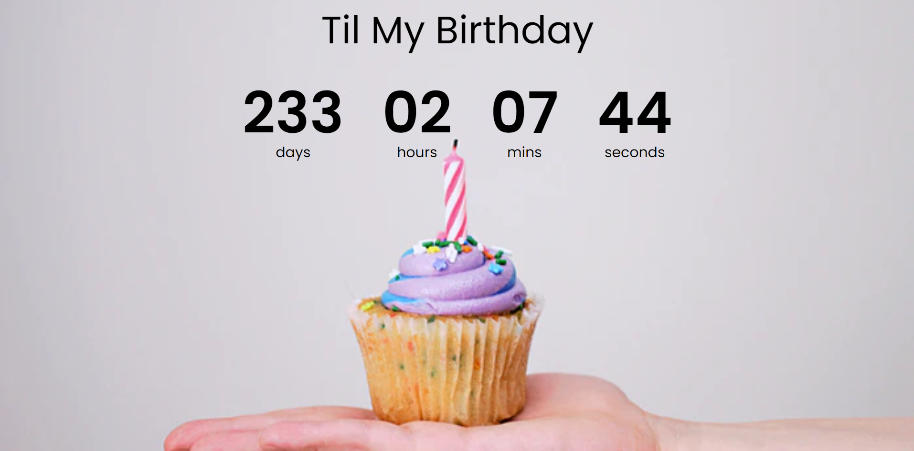

# Simple Vanilla JS Project

This is a countdown timer to My Next Year's Birthday.

### What I learned from this project

- how to calculate these things such as days, hours, minutes, seconds from the diff between toay and my birthday.
